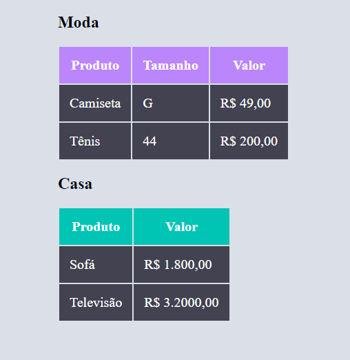

#

<h1 align="center"> Desafio HTML CSS Básico </h1>

<h2 align="center">🎉Primeiro desafio de HTML e CSS Básico</h2>

 

  

---

<h2> 🎈 Tecnologias Utilizadas: </h2>

  
  

---

 

### Gabriel Brasileiro

